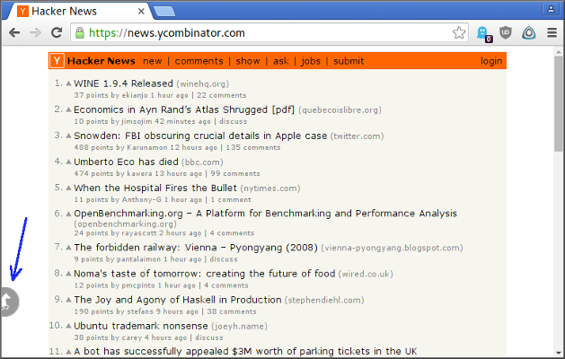
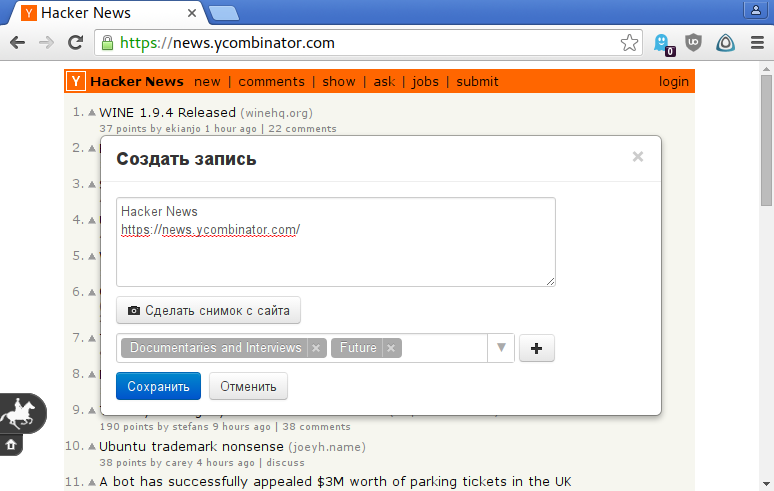
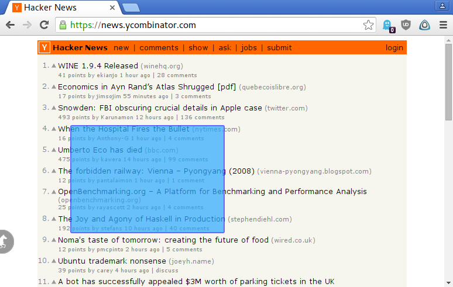

# Browser Add-ons

These add-ons were used in one of my previous projects. There function is to inject our javascript code into every open page, so that the page could communicate with our back-end server.

## Implementation

There are three separate versions of the add-on, for Chrome, Firefox, and Opera. The difference is how *a background script*, working in the browser's sandbox, talks with *an init script*, that has acces to the page's DOM.

An init script is executed on the page's DOM, but without any access to the page's javascript (it's a security policy of the browsers). It loads `agent.js` into the page, and starts to communicate with it via specially constructed DOM nodes and their attributes (duplex callback protocol).

For security reasons we had to provide our own implementation of JSON encoder/decoder, as native implementations could be corrupted by native scripts, loaded along with the page.

## User Interface

A sticky button is added on the left side of every loaded page. The user clicks the button and a dialog pops up over the page's contents. It becomes a part of the page's DOM, and it's code is working within the page's context.

*Default state of the button*  

*Dialog on the page*  

*Taking a screenshot of a selected area (will be sent to a remote server)*  

