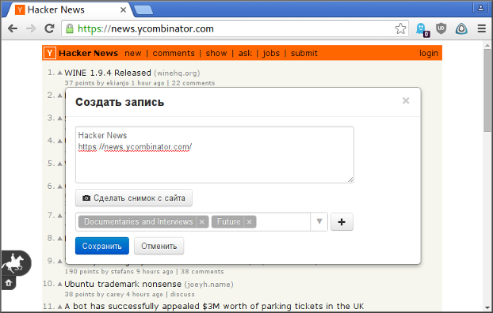
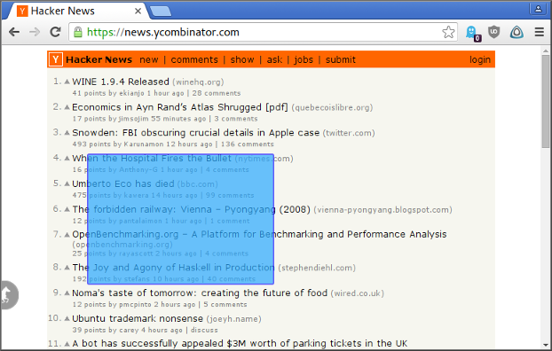

# Browser Addons

## Overview

These browser add-ons (extensions) add a sticky button onto every page a user visits. When the button is clicked, a dialog pops up over the page contents, and the user can do several actions in it. The add-ons communicate with a remote back-end service.

## User Interface

### Default state of the button

### Dialog on the page

### Taking a screenshot

## Implementation

(indirectly, via an angent script).

that inject addition functionality into every page a user visits.

The add-ons are (Chrome, Firefox, and Opera).
Here are three extensions 

Add on every page a button ... with dialogs.
Take screenshots of a selected area on the page.

Due to security restrictions...
This script is executed on the page's DOM but without any access to the page's javascript.
Communicates with Agent via specially constructed DOM nodes and their attributes (duplex callback protocol).

## Agent.js

We need to have our own implementation of JSON because the native one could be corrupted by foreign scripts.
Communicates with a back-end service over HTTPS.
